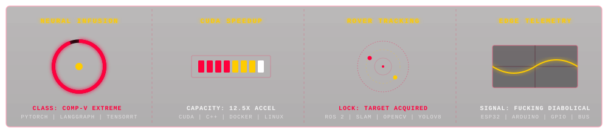

<!-- VOUGHT DATABASE SECURITY BANNER -->
<p align="center">
  
</p>

<!-- DYNAMIC TYPING WIDGET -->
<p align="center">
  <a href="https://git.io/typing-svg">
    
  </a>
</p>

<!-- VOUGHT STRATEGIC METRICS -->
<p align="center">
  
  
  
</p>

<!-- VOUGHT TACTICAL METRICS -->
<p align="center">
  
  
  
  
</p>

---

### 🖥️ Vought Dossier: Profile Status

```yaml
Subject: Aditya Kaleeswar GK
Threat Classification: CUDA & Python Engineered Supe
Clearance Level: LEVEL 5 (CLASSIFIED)
Status: Fucking Diabolical
```

---

### 📊 Supe Telemetry & Tactical Diagnostics

<p align="center">
  
</p>

---

### 📈 GitHub Activity Streak

<p align="center">
  <!-- GitHub Streak Stats (The Boys Crimson & Gold Theme) -->
  
</p>

---

### 📞 Secure Channels

<p align="center">
  <a href="mailto:adityakaleeswargk04@gmail.com">
    
  </a>
  <a href="https://linkedin.com/in/aditya-kaleeswar">
    
  </a>
  <a href="https://github.com/AdityaKaleeswarGK">
    
  </a>
</p>

```text
SIGNAL TERMINATED.
```
